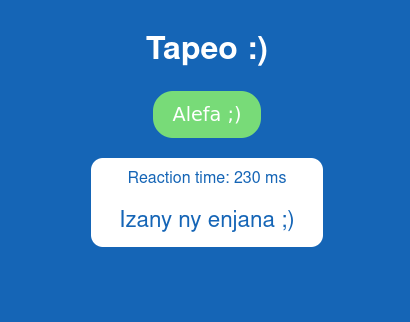

# tapeo
Tapeo is a simple game to measure your reaction tape (in ms) on block which appears suddenly



## Usage
Step 1: Clone this repository 
```
git clone https://github.com/Fullfifax/tapeo.git
```
Step 2: Browse to your local repository
```
cd tapeo
```
Step 3: Install dependencies
```
yarn install
```
### Compiles and hot-reloads for development
```
yarn serve
```

